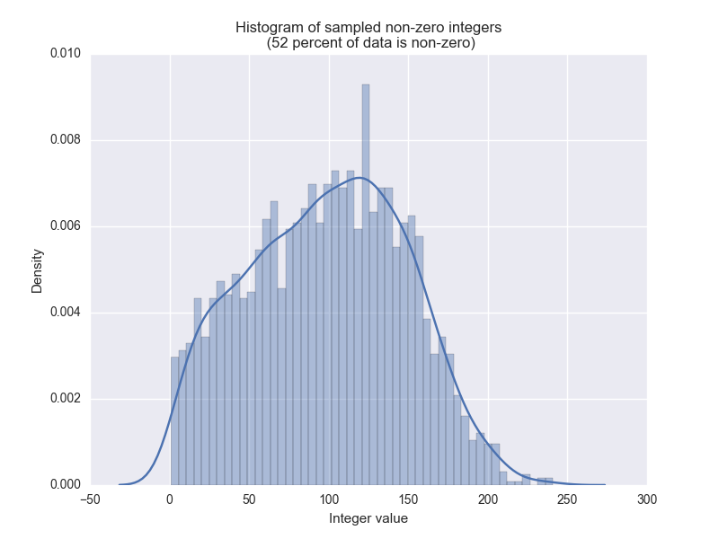

# MNIST Dataset Creation

This folder contains the scripts used to create our MNIST image classification dataset. Alternatively, we have made the datasets generated with this script publicly available [here](https://drive.google.com/drive/folders/1tr-q_uhg6PVuQKIwnLDRMtRsrG2oyS8C).

To perform feature extraction on the MNIST images, we are using an example convolutional neural network from TensorFlow. In `mnist_feature_extraction.py`, we use the TensorFlow example as-is to train the neural network, and then apply the trained neural network to the images and take the output of the layer just prior to the final classification layer. This gives us high-quality feature vectors to use in place of the raw images.

Next, in order to use this dataset on the Nearist appliances, we map the floating point feature vectors into n-bit integers in the `map_to_integers.py` script (we still retain the original floating point version of the dataset, though, for benchmarking purposes). 

## Data Transformation

To perform the integer mapping, we start by analyzing the feature values, and then selecting an appropriate mapping function. This dataset has an exponential distribution, so we use the logarithmic mapping function. This helps to reduce skew and more evenly and representatively distribute our float values across the new discrete range of 256 integer values. 

Vector values (non-zero only):

Log-transformed data (non-zero only) mapped to uint8 values between 0 and 255:

Mapping between float and integer values:

## Files
	
<table>
  <tr>  <th>File</th>                          <th>Description</th>  </tr>
  <tr>  <td>mnist_feature_extraction.py</td>   <td>Trains a CNN on the MNIST dataset, then uses the CNN to perform feature extraction to create our dataset.</td>  </tr>
  <tr>  <td>map_to_integers.py</td>            <td>Maps the floating point features to 8-bit integers and saves an integer copy of the dataset.</td>  </tr>
</table>  

## Requirements

To run these scripts, you will need TensorFlow installed. The MNIST dataset is retrieved by the scripts from TensorFlow, so you don't need to acquire the dataset separately.

## Outputs

The `mnist_feature_extraction.py` script outputs the following HDF5 dataset files:
<table>
  <tr>  <th>File</th>               <th>Dimensions</th>    <th>Component Size</th>  <th>Size</th> <th>Description</th>  </tr>
  <tr>  <td>X_train_float.h5</td>   <td>55000 x 1024</td>  <td>float</td>  <td>225.8 MB</td>  <td>Extracted feature vectors for training images.</td>  </tr>
  <tr>  <td>y_train.h5</td>         <td>55000 x 1</td>     <td>int</td>    <td>0.2 MB</td>  <td>Labels (0 - 9) for training images.</td>  </tr>
  <tr>  <td>X_test_float.h5</td>    <td>10000 x 1024</td>  <td>float</td>  <td>39 MB</td>   <td>Extracted feature vectors for test images.</td>  </tr>
  <tr>  <td>y_test.h5</td>          <td>10000 x 1</td>     <td>int</td>    <td>0.1 MB</td>  <td>Labels (0 - 9) for test images.</td>  </tr>
</table>

The `map_to_integers.py` script outputs the following HDF5 dataset files:
<table>
  <tr>  <th>File</th>               <th>Dimensions</th>    <th>Component Size</th>  <th>Size</th> <th>Description</th>  </tr>
  <tr>  <td>X_train_uint8.h5</td>     <td>55000 x 1024</td>  <td>uint8</td>  <td>56.3 MB</td>  <td>Training vectors with integer components.</td>  </tr>
  <tr>  <td>X_test_uint8.h5</td>      <td>10000 x 1024</td>  <td>uint8</td>  <td>10.2 MB</td>  <td>Test vectors with integer components.</td>  </tr>
</table>
